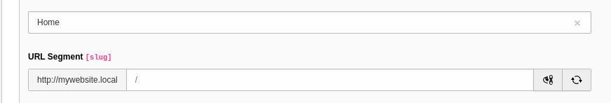

# TYPO3 Extension for Portfolio Website
- **Purpose:** Enables users to showcase their work via a portfolio website.
- **Based On:** [StartBootstrap Personal Repository](https://github.com/StartBootstrap/startbootstrap-personal.git)
- **Version:** 1.0.0
## Installation
- **Requirements:**
  - Compatible with TYPO3 versions 12.4.0^ (I didn't test it with Version 13)
  - PHP >= 8.1.0 <= 8.3.99
  - Composer >= 2.1
- **Installation Steps:**
    - Install TYPO3
        - Using DDEV [DDEV](https://ddev.readthedocs.io/en/stable/)
        - Use my own Docker TYPO3 Development environment [Typo3 docker-compose](https://github.com/dev-Toumeh/php-dockerCompose-devstack/tree/typo3)
    - Add the extension using composer
       1. DDEV
            1. ```bash
               ddev composer config repositories.mywebsite git https://github.com/dev-Toumeh/typo3-Portfolio-extension
               ```
            2. ```bash
               ddev composer require toumeh/mywebsite:dev-master
               ```
       2. Docker or local Environment 
           1. ```bash
                composer config repositories.mywebsite git https://github.com/dev-Toumeh/typo3-Portfolio-extension
               ```
           2. ```bash
                composer require toumeh/mywebsite:dev-master
               ```
    - Clear cache 
    - After you installed the extension, you can check it by Navigation to Admin Tools in typo3 backend Interface and then Extensions then type my-website into a search Section.
    - Create two pages: 'Home' and 'Contact'

       - In the 'Home' page, 
         - add the 'Active Home Page Plugin'
          
           
          
         - Your Segment should look like this
          
            
          
       - in Page 'Contact' 
         - add the 'active json response plugin' 
          
           
          
         - Your Segment should look like this
          
           
          
- **Configuration:**
    - add your GitHub page by going to list Module -> Create new Record -> Urls -> choice GitHub
    - add your linden profile link by going to list Module -> Create new Record -> choice LinkedIn
    - add Resume Page fields Experiences, Education Technologies and skills by creating the relevant Records.
    - The same apply for Projects Page
    - adding the contact Email Page configuration needs from you to register on sendgrid.com and tha add your contact data inside the following page in the extension
      Classes/Service/EmailService.php
      
    - **I'm currently working on integrating the extension with Typo3 SMTP functionalities, so the email would be adaptable directly from the Backend Interface, which will be available in the forthcoming update.**

    
## Troubleshooting
## FAQs
- NNo Question until now

## Changelog

## Contact and Support Information

- For support, contact dev.toumeh@gmail.com
